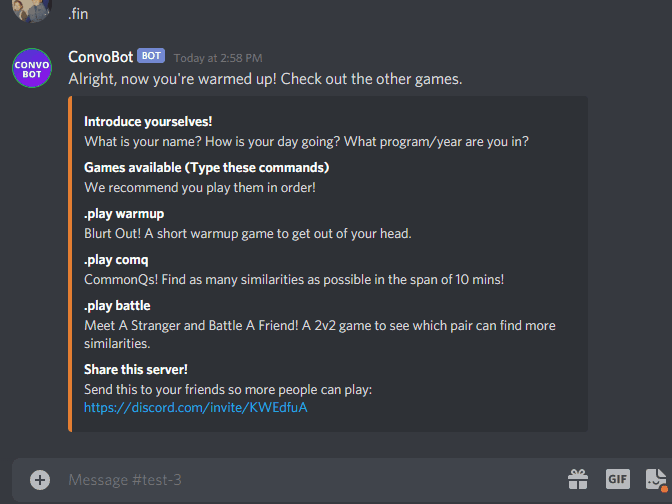
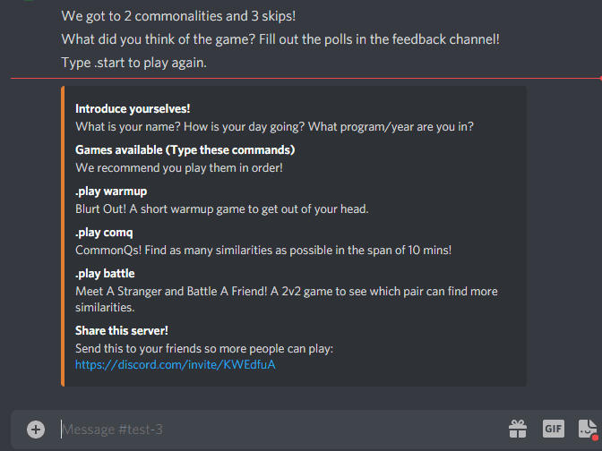

# ConvoBot
A Discord ChatBot that helps users have smooth conversations when meeting someone. 

Used in my discord server, UW Meet Friends, a community of 260+ members.
Check us out on instagram: https://www.instagram.com/uwmeetfriends/

To test out this bot, invite it to a discord server using this [link](https://discord.com/api/oauth2/authorize?client_id=768205181267476500&permissions=8&scope=bot) or join our [discord server](https://discord.com/invite/KWEdfuA) and type .play in the bot-commands channel.

Here is ConvoBot in action (there are three icebreaker games built):

Blurt out! - a warmup game:

CommonQs game:

Meet A Stranger and Battle A Friend! - a 2v2 game:

The original idea was to create an app, as shown below. The ChatBot was an MVP for this idea.

